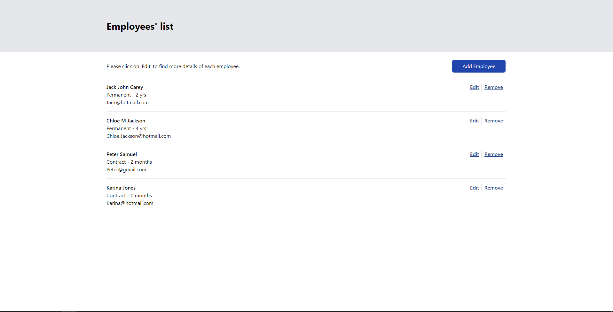
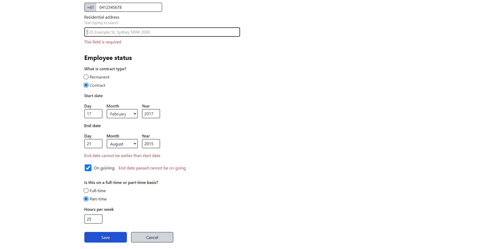
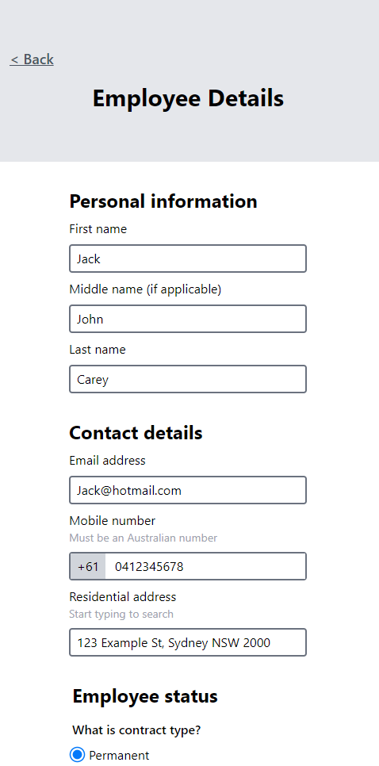

# Employee-Tracker

## Demo & Snippets
- Desktop and Mobile view





---


## Requirements / Tech Stack


- We need a web application to create, list, modify and delete employees. The application should consist of a
RESTful API (can be in .net core or any backend framework of your choice) and a React frontend. The schema for
the employee is left to the criteria of the candidate.


- Frontend:
  - React with Type Script
    - ReactQuery - In order to more easily manage fetching data, loading and error states
    - React Form Hook - Used to manage submission of forms and a in built robust way to handle form errors easily
    - React-router-dom - for managing routes for the single page application.
    - axios - used for calling api endpoints and also good for mock testing.
    <br />
  - TailwindCSS
    -  This is a lightweight framework which uses utility classes to style elements. 
    -  This framework was selected as it provides fast and efficient development, especially when it comes to responsive styling.
    -  Personally I find it easier to build specific elements when all the styles and elements are in one place as utility classes are used.
    <br />
- Backend:
  - Spring Boot: I have some experience already building with this framework so I decided to use it for this project.
  - MySQL: Popular database with an easy to understand language and easy to set up.
---


## Build Steps


-   After downloading/cloning repository
- To install dependencies open terminal cd into the Employee-Tracker folder


```
npm install
```


- Run Application


```
npm run dev
```


- Database
  - Download MySQL - [Link](https://dev.mysql.com/downloads/installer/)
  - Set up password for MySQL needed for backend application properties
  - Set up a MySQL connection
  - Enter connection and create database with


```
CREATE DATABASE employee_list;
```


- Backend
  - Import Employee_Tracker-Server folder in Eclipse IDE or any IDE compatible with Java


- Setting up application properties - navigate to Employee-Tracker/Employee_Tracker-Server/src/main/resources/application.properties
- Change password to your MySQL pass (This will connect the backend to database)
```
spring.datasource.url=jdbc:mysql://localhost:3306/employee_list
spring.datasource.username=root
spring.datasource.password=(Change this to your pass)
spring.jpa.hibernate.ddl-auto=update
spring.jpa.properties.hibernate.dialect = org.hibernate.dialect.MySQL5InnoDBDialect
```


- To run backend server:
  - Navigate to Employee-Tracker/Employee_Tracker-Server/src/main/java/com/example/employeeList/EmployeeListApplication.java
  - Run the file to start server


---


## Design Goals / Approach


-   Wire frames were provided, so my design goals were to try to recreate given designs as close as possible.
-   As the wire frames were for desktop design, I first created the project styles for desktop first then made it mobile responsive as I deemed best fit.


---


## Features


- Users have the ability to create, list, modify and delete employees.
- On the employee list page when data is being fetched considerations have been made for displaying loading and failing to fetch situations.
- Form Validation:
  - When end dates are earlier than the start date form errors will be displayed
  - When on going is checked and end date is earlier than today's date a error will be displayed
  - Required validation on all inputs besides middle name and errors will be displayed when any required inputs have no value.
  - First, Middle, Last names input can only enter alphabetic characters
  - Email validation to require @ symbol
  - Mobile validation to be less than 10 digits and only contain numbers with error cases handling both.
  - Start and End day date validations to be numbers and between 1 - 31 with error msg when validation is not met
- When adding/updating employees and axios request fails an error message will be displayed
- Responsive for both desktop and mobile.
  <br />
- Backend error handling with Optional class for Not found errors
- Custom BadRequestException handling for invalid dates
- Internal server error handling with try catch blocks in the controller


---


## Known issues


- EmployeeEditTest component is not well tested
  - Axois 400 error when clicking submit button even though form validation should stop request from happening.
  - Also default values are not being fetched with react form hook
 
---


## Future Goals


-   Writing more tests to test for more scenarios
-   Perform backend e2e tests with seeder to test for more situations
-   Adding sorting feature to employee list sorting by Id
-   Search bar for employee list to search for specific employees


---


## Change logs


### 21/02/2023 - Tests, helperFunctions 
-   Created Controller tests for the backend
-   Extracted logic into helperFunction and created tests (calculating time in company logic)
-   Some responsive styling on employee card component


### 20/02/2023 - Splitting components, error
-   Split form into section components to manage better
-   Error handling on form submission via axois
-   More Error handling on form inputs


### 19/02/2023 - Validation, tests
-   Created validation helper functions in separate folder to help validated dates in form
-   Created Spring service tests in the backend
-   In helper functions created canBeOnGoingHelper to validate Ongoing input in form.
-   Added styling for responsiveness


### 18/02/2023 - Creating API endpoints and pages in react


-   Create, Read, Update, Delete endpoints made in Spring
-   Home page made, Routes made for /, employee/add, employee/edit/:id
-   Employee Card component created to be mapped to display list of employees
-   EmployeeAdd, EmployeEdit pages created


---


## What did you struggle with?
- Testing 
  - I was not too familiar with spring testing and to research videos and docs to learn and understand more about it.
  - Frontend testing with mocking with axios as I could not figure out why the employeeEdit tests were not working, after time boxing the issue I thought it was best to move on to other tests.
---


## Stay in touch


- [Portfolio](https://edric-khoo.vercel.app/)
- [Linkedin](https://www.linkedin.com/in/edric-khoo-98881b173/)


